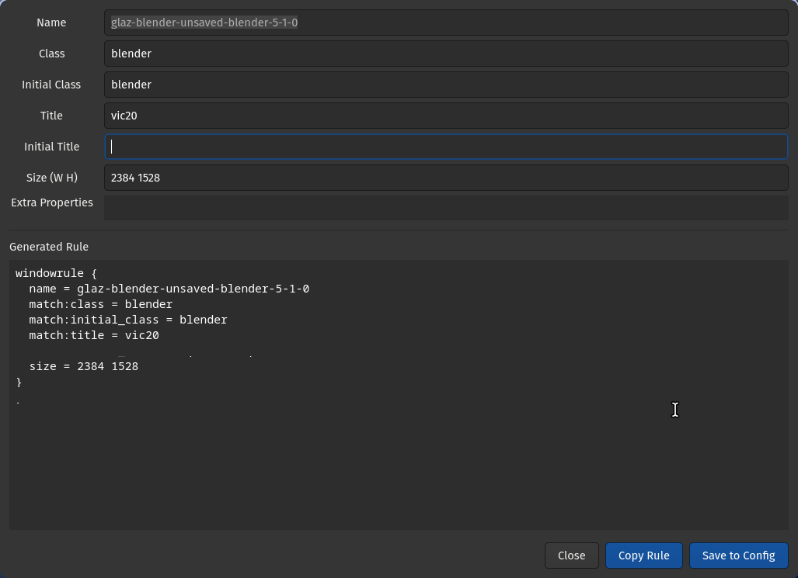

# hyprglaz

A Hyprland window rule generator. Draw a region on screen, and hyprglaz finds the window underneath and builds a `windowrule` block you can copy or save directly to your config.



## Usage

```bash
./hyprglaz.py
```

Draw a selection box over any part of a window. hyprglaz queries Hyprland for the topmost visible window in that region on the active workspace and opens the editor.

### Options

```
-o FILE, --output FILE    Config file to save rules into
                          (default: ~/.config/hypr/conf/windowrules/custom.conf)
```

## UI

The editor pre-fills all fields from the selected window's Hyprland client properties:

Clear any field to drop that match condition from the rule entirely.

### Buttons

- **Close** — discard and exit
- **Copy Rule** — copies the generated rule block to the Wayland clipboard
- **Save to Config** — writes the rule to the output file. If a rule with the same `name` already exists in the file it is replaced in-place; otherwise the rule is appended. The button briefly shows `Saved (appended)` or `Saved (replaced)` to confirm.

## Keybinding

Add this to your Hyprland config (e.g. `~/.config/hypr/hyprland.conf`) to invoke hyprglaz with `Super + Shift + G`:

```
bind = $mainMod SHIFT, G, exec, /path/to/hyprglaz.py
```

Replace `/path/to/hyprglaz.py` with the absolute path to the script, or move it somewhere on your `$PATH` and just use the filename.

## Dependencies

| Package | Arch package | Purpose |
|---|---|---|
| Python 3 | `python` | Runtime |
| GTK 4 + GObject introspection | `gtk4` `python-gobject` | UI |
| slurp | `slurp` | Region selection |
| Hyprland | `hyprland` | Window data via `hyprctl` |
| wl-clipboard | `wl-clipboard` | Clipboard (`wl-copy`) |

Install all at once on Arch:

```bash
sudo pacman -S python python-gobject gtk4 slurp wl-clipboard
```

## License

MIT
