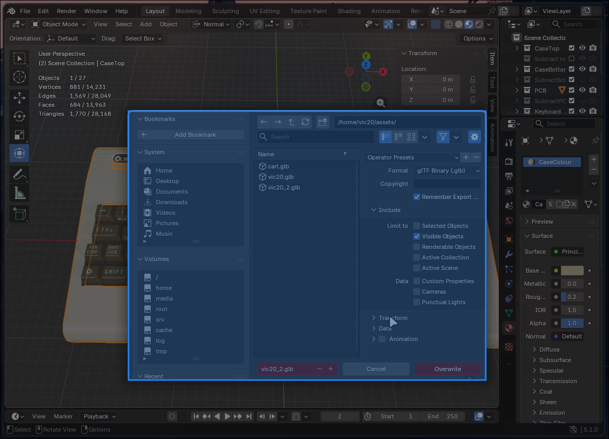
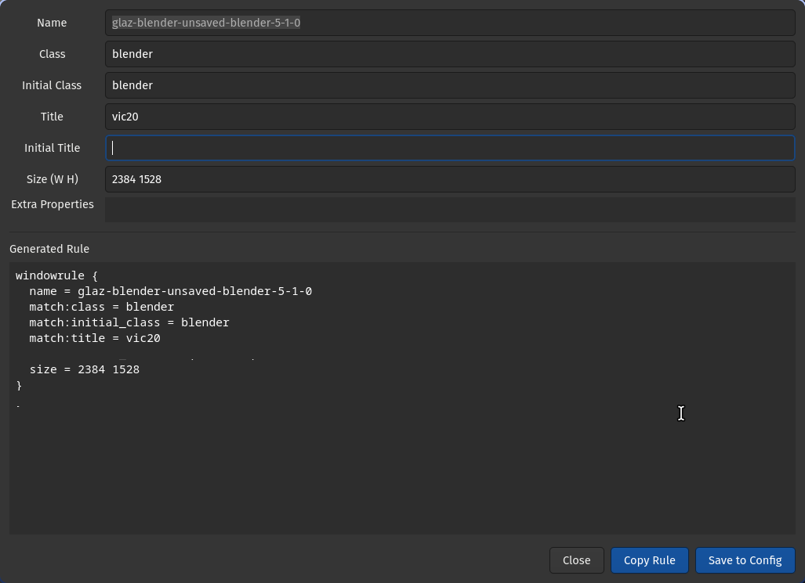

# hyprglaz

A Hyprland window rule generator. Set up your window the way you want it, select it with hyprglaz, then copy or save the generated `hl.window_rule` block directly to your config.

Rules are emitted in Hyprland's Lua config format, ready to drop into an ML4W dotfiles `conf/windowrules/*.lua` file:

```lua
hl.window_rule({
    name  = "glaz-btop",
    match = {
        class = "btop",
        initial_class = "btop",
    },

    size  = "1904 1041",
    float = true,
})
```





## Usage

```bash
./hyprglaz.py
```

Move your cursor over a window — hyprglaz highlights it with a hover rectangle. Click to select; the topmost visible window on the active workspace opens in the editor. Press Escape to cancel.

### Options

```
-o FILE, --output FILE    Config file to save rules into
                          (default: ~/.config/hypr/conf/windowrules/custom.lua)
```

Update path for the ML4W dotfiles custom window rules file `conf/windowrule.lua` with `load_variant("custom.lua", "windowrules")`.

## UI

The editor pre-fills all fields from the selected window's Hyprland client properties:

Clear any field to drop that match condition from the rule entirely.

**Extra Properties** takes one Lua `key = value` pair per line — the trailing commas are added for you. Use Lua literals, so `float = true`, `size = "70% 60%"`, `border_size = 0`, and `-- comments` where you want them. Values in match fields are regexes and are escaped for you; a regex containing backslashes is emitted as a `[[...]]` long string so Lua leaves it intact.

### Buttons

- **Close** — discard and exit
- **Copy Rule** — copies the generated rule block to the Wayland clipboard
- **Save to Config** — writes the rule to the output file. If a rule with the same `name` already exists in the file it is replaced in-place; otherwise the rule is appended. The button briefly shows `Saved (appended)` or `Saved (replaced)` to confirm.

## Keybinding

Add this to your keybindings config (ML4W: `~/.config/hypr/conf/keybindings/custom.lua`) to invoke hyprglaz with `Super + Shift + G`:

```lua
hl.bind("SUPER + SHIFT + G", hl.dsp.exec_cmd("/path/to/hyprglaz.py"), { description = "Generate a window rule with hyprglaz" })
```

Replace `/path/to/hyprglaz.py` with the absolute path to the script, or move it somewhere on your `$PATH` and just use the filename.

## Dependencies

| Package | Arch package | Purpose |
|---|---|---|
| Python 3 | `python` | Runtime |
| GTK 4 + GObject introspection | `gtk4` `python-gobject` | UI |
| pycairo | `python-cairo` | Cairo bindings for picker drawing |
| grim | `grim` | Screenshot for picker background |
| Hyprland | `hyprland` | Window data via `hyprctl` |
| wl-clipboard | `wl-clipboard` | Clipboard (`wl-copy`) |

Install all at once on Arch:

```bash
sudo pacman -S python python-gobject python-cairo gtk4 grim wl-clipboard
```

## References

- [Hyprland Window Rules](https://wiki.hypr.land/Configuring/Window-Rules/)

## License

MIT
